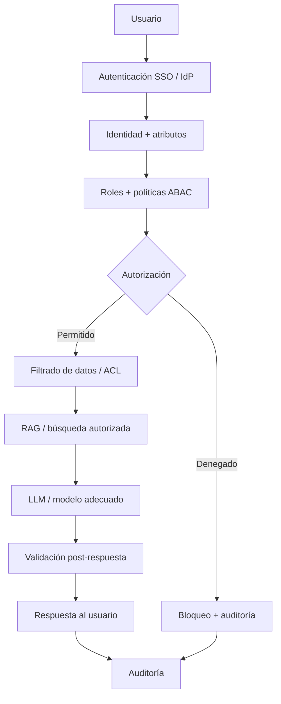
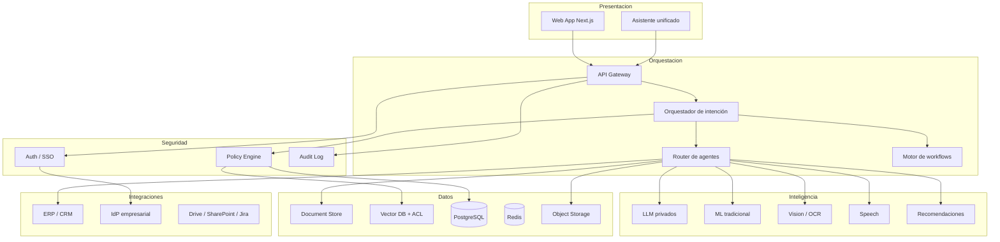
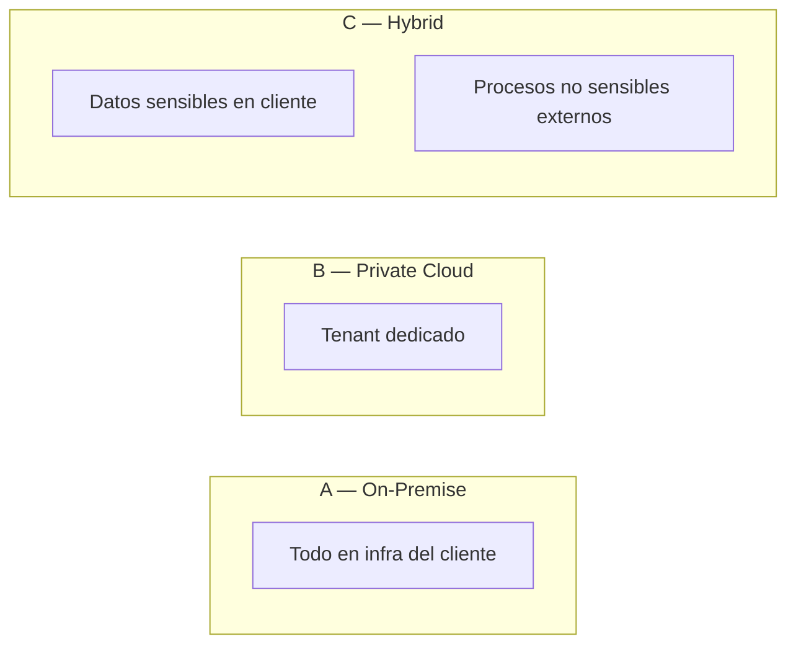
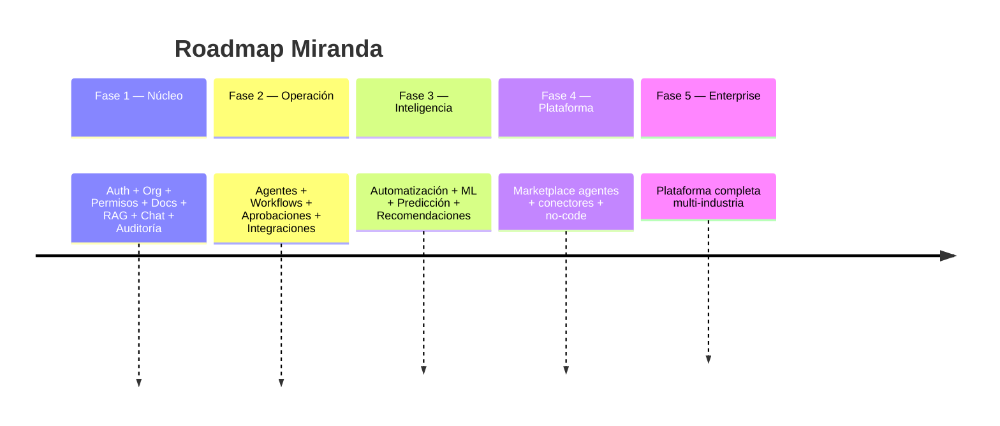

# Miranda — Enterprise Private AI Platform

Plataforma empresarial de IA privada para desplegar LLM, RAG, agentes y automatización **dentro de la infraestructura del cliente** (on-premise, nube privada o híbrido), con control de acceso granular y auditoría completa.

> Nombre temporal del producto: **Enterprise Private AI Platform**  
> Nombre del proyecto / empresa: **Miranda**

---

## Idea en una frase

Una capa inteligente que se integra con los sistemas de la empresa y permite que cada empleado use IA **según su cargo, departamento, jerarquía, proyecto y permisos** — sin que el LLM decida qué puede ver.

---

## Principios no negociables

| #   | Principio                        | Significado                                                        |
| --- | -------------------------------- | ------------------------------------------------------------------ |
| 1   | **El LLM no controla seguridad** | Autorización siempre antes de recuperar datos y antes de responder |
| 2   | **Privacidad por diseño**        | Datos sensibles no deben salir necesariamente a IA pública         |
| 3   | **Tecnología adecuada**          | No todo es LLM: ML, reglas, OCR, workflows, agentes, APIs          |
| 4   | **Human-in-the-loop**            | Acciones críticas requieren aprobación humana                      |
| 5   | **Auditable**                    | Toda consulta, recuperación y acción queda registrada              |
| 6   | **Modular y evolutivo**          | No cerrar la arquitectura demasiado pronto                         |

---

## Mapa del repositorio

| Archivo                                                            | Para qué sirve                                                     |
| ------------------------------------------------------------------ | ------------------------------------------------------------------ |
| [README.md](./README.md)                                           | Visión, diagramas y punto de entrada                               |
| [docs/BUILD-README.md](./docs/BUILD-README.md)                     | **Manual de construcción MVP** (fases 0–5, LLM 8B, DoD)            |
| [docs/FUNCTIONALITY.md](./docs/FUNCTIONALITY.md)                   | **Fuente de verdad** de funcionalidades (validar cada cambio aquí) |
| [docs/ARCHITECTURE-MEMORY.md](./docs/ARCHITECTURE-MEMORY.md)       | Decisiones, pendientes, supuestos, riesgos                         |
| [docs/ARCHITECTURE.md](./docs/ARCHITECTURE.md)                     | Arquitectura técnica y de despliegue                               |
| [docs/AUTH-AND-PERMISSIONS.md](./docs/AUTH-AND-PERMISSIONS.md)     | Auth, SSO, RBAC/ABAC                                               |
| [docs/RAG-AND-SECURITY.md](./docs/RAG-AND-SECURITY.md)             | RAG seguro y anti-leakage                                          |
| [docs/AGENTS-AND-WORKFLOWS.md](./docs/AGENTS-AND-WORKFLOWS.md)     | Agentes, workflows, aprobaciones                                   |
| [docs/DOCUMENTS-MULTIMEDIA.md](./docs/DOCUMENTS-MULTIMEDIA.md)     | Documentos, multimedia, clasificación                              |
| [docs/AUDIT-COMPLIANCE.md](./docs/AUDIT-COMPLIANCE.md)             | Auditoría, privacidad, compliance                                  |
| [docs/BUSINESS-OPPORTUNITIES.md](./docs/BUSINESS-OPPORTUNITIES.md) | TOP 100 / TOP 10 / TOP 5 MVP                                       |
| [docs/EMPRESA-A.md](./docs/EMPRESA-A.md)                           | Empresa ficticia de referencia                                     |
| [docs/ROADMAP-AND-BUSINESS.md](./docs/ROADMAP-AND-BUSINESS.md)     | Roadmap y modelo de negocio                                        |
| [docs/MODULES.md](./docs/MODULES.md)                               | Módulos de diseño (mapados a fases build)                          |
| [docs/HOW-TO-ITERATE.md](./docs/HOW-TO-ITERATE.md)                 | Cómo modificar la idea sin romper contexto                         |
| [docs/AI-CONTEXT.md](./docs/AI-CONTEXT.md)                         | Contexto corto obligatorio para la IA                              |

---

## Visión del flujo seguro

**Regla de oro:** si el usuario no tiene permiso, el documento **nunca** entra al contexto del LLM.

---

## Capas de la plataforma

---

## Cuándo usar cada tecnología

| Tecnología                | Usar cuando…                                              | No usar cuando…                                              |
| ------------------------- | --------------------------------------------------------- | ------------------------------------------------------------ |
| **LLM**                   | Razonamiento, redacción, explicación, extracción flexible | Cálculos exactos, control de acceso, estadísticas inventadas |
| **RAG**                   | Respuestas basadas en documentos/políticas internas       | Datos tabulares masivos (mejor SQL + permisos)               |
| **Fine-tuning / LoRA**    | Estilo, dominio estrecho, clasificación estable           | Datos que cambian a diario (preferir RAG)                    |
| **ML tradicional**        | Predicción, scoring, anomalías, churn                     | Explicaciones narrativas (el LLM explica resultados del ML)  |
| **Recomendaciones**       | Cross/up-sell, next-best-action                           | Sin historial suficiente                                     |
| **Vision / OCR**          | Facturas, planos, fotos, IDs                              | Texto ya estructurado                                        |
| **STT / TTS**             | Reuniones, voz, accesibilidad                             | Texto nativo disponible                                      |
| **Reglas de negocio**     | Cumplimiento determinista, umbrales, compliance           | Casos ambiguos abiertos                                      |
| **Workflows**             | Aprobaciones, escalamiento, SLA                           | Consultas informativas simples                               |
| **Agentes**               | Multi-paso con herramientas acotadas                      | Una sola consulta de lectura                                 |
| **APIs / automatización** | Integración con sistemas existentes                       | Sustituir procesos sin dueño humano                          |

---

## Modalidades de despliegue

| Criterio      | On-Premise           | Private Cloud     | Hybrid          |
| ------------- | -------------------- | ----------------- | --------------- |
| Privacidad    | Máxima               | Alta              | Alta controlada |
| Costo inicial | Alto                 | Medio-alto        | Medio           |
| Escalabilidad | Limitada por cliente | Alta              | Alta            |
| Mantenimiento | Cliente + Miranda    | Miranda / managed | Compartido      |
| Complejidad   | Alta                 | Media             | Alta            |

Detalle: [docs/ARCHITECTURE.md](./docs/ARCHITECTURE.md).

---

## Roadmap resumido

Detalle: [docs/ROADMAP-AND-BUSINESS.md](./docs/ROADMAP-AND-BUSINESS.md).

---

## MVP recomendado (TOP 5)

1. **Asistente documental con RAG + ACL** — chat sobre políticas/manuales autorizados
2. **Ingesta y clasificación de documentos** — metadatos + confidencialidad
3. **Motor de permisos RBAC/ABAC** — base de toda la plataforma
4. **Auditoría de consultas IA** — quién vio qué y con qué fuentes
5. **Caso vertical RRHH (consultas de políticas / candidatos a promoción)** — demo ROI

Ver ranking completo: [docs/BUSINESS-OPPORTUNITIES.md](./docs/BUSINESS-OPPORTUNITIES.md).

---

## Cómo trabajar este proyecto

1. Leer este README y `docs/FUNCTIONALITY.md`.
2. Para **construir el MVP**: seguir [docs/BUILD-README.md](./docs/BUILD-README.md) fase por fase.
3. Revisar `docs/ARCHITECTURE-MEMORY.md` antes de proponer cambios.
4. Cada cambio debe **validarse** contra `FUNCTIONALITY.md` (ver [HOW-TO-ITERATE](./docs/HOW-TO-ITERATE.md)).
5. Diseño fino: **“continuar”** → [MODULES.md](./docs/MODULES.md). Implementación: **“ejecuta Fase N”**.
6. Gate de código: no implementar una fase sin DoD de la anterior en el BUILD-README.

---

## Estado actual

| Área                   | Estado                                                          |
| ---------------------- | --------------------------------------------------------------- |
| Visión y documentación | Lista (M00)                                                     |
| Manual de construcción | [BUILD-README](./docs/BUILD-README.md) — fases 0–5 documentadas |
| Código de producto     | No iniciado                                                     |
| Build activo           | Fase 0 pending → di **`ejecuta Fase 0`**                        |
| Diseño siguiente       | M01 (org/permisos) en paralelo si hace falta                    |

---

## Equipo de diseño (roles que debe simular la IA)

CEO · CTO · Arquitecto de software · Arquitecto de IA · Ingeniero ML · Ciberseguridad · Arquitecto de datos · Product Manager · Consultor empresarial · Ventas B2B · SaaS · Compliance

Al analizar cualquier idea: problema → quién paga → por qué → ROI → datos → modelos → qué es/no es LLM → arquitectura → seguridad → permisos → integraciones → MVP → enterprise → venta.

**No inventar estadísticas de mercado.** Si se necesitan datos actuales, citar fuentes.
