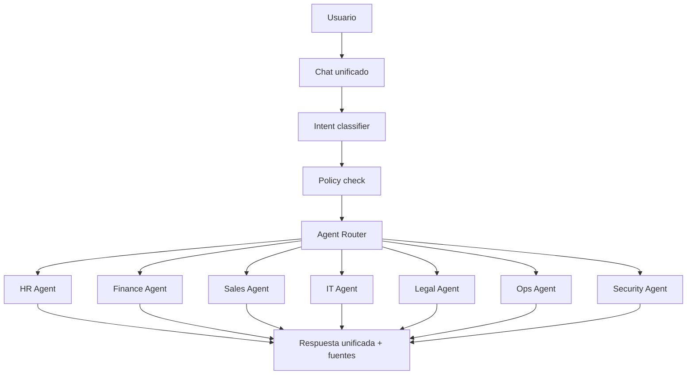
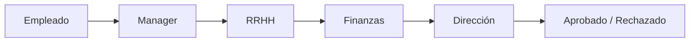

# Agentes, workflows y aprobaciones

IDs: `F-AGT-*`, `F-WF-*`, `F-CHAT-*`

---

## 1. Experiencia: un solo asistente

El usuario habla con **un asistente**. Internamente, un router elige agente/herramientas.

Ejemplo: *“¿Cuál es el costo estimado de contratar a 5 empleados nuevos?”*

1. Detecta intención (HR + Finance)
2. Verifica permisos de compensación/headcount
3. Consulta solo datos autorizados
4. Calcula con reglas/ML (no “inventa” el LLM)
5. LLM explica el cálculo
6. Marca si requiere aprobación

---

## 2. Contrato de un agente

Cada agente define:

| Campo | Descripción |
|-------|-------------|
| Scope | Dominio (HR, Finance…) |
| Tools | Allowlist explícita |
| Data sources | Sistemas/colecciones permitidas |
| Permissions ceiling | Nunca por encima del usuario |
| Limits | Rate, costo, acciones |
| Escalation | Cuándo pedir humano |

**Regla:** el usuario no puede usar un agente para saltarse permisos de otro (`F-AGT-007`).

---

## 3. Workflows con human-in-the-loop

Ejemplo: solicitud de aumento salarial.

La IA puede:

- Analizar la solicitud
- Preparar documentación
- Generar recomendaciones
- Detectar inconsistencias
- Calcular escenarios

La IA **no** aprueba ni ejecuta sola acciones críticas (`F-WF-003`, `F-WF-005`).

Capacidades del motor:

- Approval chains
- Escalamiento
- Delegación
- Rechazo / revisión
- Auditoría por paso
