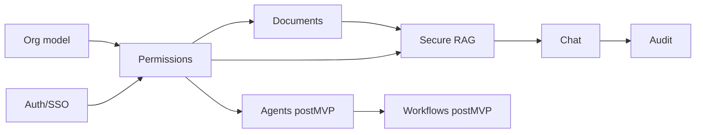

# Architecture Memory — Miranda

Registro vivo de decisiones. **Actualizar en cada cambio relevante.**

Última actualización: 2026-08-02

---

## 1. Decisiones tomadas

| ID | Fecha | Decisión | Motivo | Impacta |
|----|-------|----------|--------|---------|
| D-001 | 2026-08-02 | Nombre proyecto: **Miranda**; producto temporal: Enterprise Private AI Platform | Branding interno vs nombre comercial abierto | Docs |
| D-002 | 2026-08-02 | El LLM **nunca** autoriza | Evitar data leakage y privilege escalation | F-SEC-008, todo RAG/agentes |
| D-003 | 2026-08-02 | Deny-by-default en permisos | Least privilege | F-PERM-009 |
| D-004 | 2026-08-02 | Auth empresarial vía IdP (OIDC primero) | UX + seguridad + offboarding | F-AUTH-* |
| D-005 | 2026-08-02 | RBAC + ABAC combinados | Granularidad real de empresa | F-PERM-001/002 |
| D-006 | 2026-08-02 | Stack MVP preferido: Next.js + NestJS + PostgreSQL + Redis + MinIO + pgvector + Ollama/vLLM | Equilibrio velocidad/control on-prem | ARCHITECTURE |
| D-007 | 2026-08-02 | Tres modos de deploy: on-prem, private cloud, hybrid | Encaje enterprise | F-DEP-001..003 |
| D-008 | 2026-08-02 | Human-in-the-loop obligatorio en acciones críticas | Riesgo legal/operativo | F-WF-003 |
| D-009 | 2026-08-02 | LLM no inventa estadísticas; explica salidas de ML/reglas | Confianza y auditabilidad | F-AI-008 |
| D-010 | 2026-08-02 | Trabajo por módulos; no construir todo de golpe | Proyecto evolutivo | MODULES |
| D-011 | 2026-08-02 | FUNCTIONALITY.md es fuente de verdad validable | Control de contexto IA/humano | FUNCTIONALITY |
| D-012 | 2026-08-02 | MVP vertical inicial: documentos + RAG ACL + permisos + auditoría + demo RRHH | ROI demostrable temprano | BUSINESS / ROADMAP |
| D-013 | 2026-08-02 | Vector DB MVP = **PostgreSQL + pgvector** | Menos servicios; ACL por allow-list `document_id` + `tenant_id` | F-RAG-001, P-001 |
| D-014 | 2026-08-02 | IdP local MVP = **Keycloak** (OIDC); Entra/Google después | Demo SSO sin depender del IdP del cliente | F-AUTH-*, P-002 |
| D-015 | 2026-08-02 | Tenancy MVP = **DB compartida + `tenant_id`** (RLS como hardening posterior) | Velocidad de PoC; aislamiento en app | F-ORG-007, P-003 |
| D-016 | 2026-08-02 | Cola MVP = **Redis** | Suficiente para ingesta; Kafka después si volumen | F-DOC-009, P-004 |
| D-017 | 2026-08-02 | Primer vertical de venta/demo = **RRHH** | Alineado con D-012 y Empresa A | P-006, F-HR-001 |
| D-018 | 2026-08-02 | LLM default = **Ollama `llama3.1:8b`** + embeddings **`nomic-embed-text`** | Tamaño medio viable en laptop 16GB+ | F-AI-001/005, P-007 |
| D-019 | 2026-08-02 | Air-gap Fase 1 = **parcial** (pull modelos una vez; runtime sin IA pública) | Realista para desarrollo; air-gap estricto después | F-DEP-001, P-008 |
| D-020 | 2026-08-02 | Guía de implementación = [`BUILD-README.md`](./BUILD-README.md); gate = DoD por fase | Absorbe M15; evita codear sin plan | MODULES, build |
| D-021 | 2026-08-02 | Monorepo: `apps/web`, `apps/api`, `apps/worker`, `packages/shared`, `infra/docker` | Claridad MVP | ARCHITECTURE / BUILD |

---

## 2. Decisiones pendientes

| ID | Pregunta | Opciones | Bloquea |
|----|----------|----------|---------|
| P-005 | Nombre comercial final | Miranda vs otro | Marketing |
| P-009 | Librería exacta de parsing PDF/DOCX en worker | pdf-parse / unpdf / Apache Tika… | Fase 3 ingesta |
| P-010 | Estrategia de sesión (cookie httpOnly vs JWT access+refresh) | Cookie BFF vs bearer | Fase 1 auth |
| P-011 | Cuantización / variante exacta del 8B en hardware bajo | Q4_K vs default Ollama | Fase 0 perf |

~~P-001~~ → D-013 · ~~P-002~~ → D-014 · ~~P-003~~ → D-015 · ~~P-004~~ → D-016 · ~~P-006~~ → D-017 · ~~P-007~~ → D-018 · ~~P-008~~ → D-019

---

## 3. Supuestos

| ID | Supuesto | Riesgo si es falso |
|----|----------|--------------------|
| S-001 | Clientes enterprise aceptan contenedores (Docker/K8s) | Empaquetado alternativo más caro |
| S-002 | Existe un IdP usable (Google/Microsoft/AD) o Keycloak en PoC | Login local temporal necesario |
| S-003 | Hay documentos digitables para RAG | Valor del chat cae; pivot a procesos/OCR |
| S-004 | Hay sponsor interno (IT + negocio) | Proyecto se queda en PoC |
| S-005 | Hardware 16GB+ permite demo con 8B cuantizado | Bajar a 3B o usar máquina remota |
| S-006 | pgvector basta hasta volumen moderado del PoC | Migrar a Qdrant/Milvus (reabrir diseño) |

---

## 4. Riesgos

| ID | Riesgo | Severidad | Mitigación |
|----|--------|-----------|------------|
| R-001 | Prompt injection → data leak | Alta | ACL pre-retrieval + sanitización + post-filter |
| R-002 | Over-scoping (querer 100 casos a la vez) | Alta | BUILD-README fases + TOP 5 MVP |
| R-003 | Competencia con Copilot/ChatGPT Enterprise | Media | On-prem + permisos granulares + workflows |
| R-004 | Cumplimiento legal mal interpretado | Alta | Validar con compliance; no afirmar certificación prematura |
| R-005 | Costos / latencia GPU u 8B en CPU | Media | Model routing; expectations en Fase 5 |
| R-006 | Integraciones infinitas | Media | Conectores priorizados post-MVP |
| R-007 | Saltarse Policy Engine “para demos rápidas” | Alta | Gate Fase 1 antes de chat |

---

## 5. Componentes (mapa actual)

| Componente | Rol | Estado diseño |
|------------|-----|---------------|
| Web App | UI chat + admin | proposed (Fase 4) |
| API Gateway / NestJS | APIs, orquestación | proposed (Fase 1+) |
| Policy Engine | AuthZ RBAC/ABAC | accepted — build Fase 1 |
| Doc Service | Upload/metadata/ACL | proposed (Fase 2) |
| Ingestion Pipeline | Parse/chunk/embed | proposed (Fase 3) |
| Vector Store | pgvector + ACL allow-list | **accepted** (D-013) |
| LLM Runtime | Ollama 8B | **accepted** (D-018) |
| Agent Router | Intención → agente | Post-MVP |
| Workflow Engine | Aprobaciones | Post-MVP |
| Audit Service | Logs consulta/acción | accepted — desde Fase 1 |
| Connector Hub | IdP/Drive/ERP… | Post-MVP (Keycloak en MVP) |

---

## 6. Dependencias críticas



---

## 7. Modelo de datos (borrador conceptual)

Entidades mínimas MVP (ver BUILD-README):

- `Tenant` / `Organization`
- `OrgUnit` (dept, team, branch…)
- `User`, `Membership`
- `Role`, `Permission`, `Policy`
- `Document`, `DocumentVersion`, `DocumentACL`
- `Chunk`, `EmbeddingRef` (pgvector)
- `Conversation`, `Message`
- `AuditEvent`

---

## 8. APIs (borrador)

| Área | Ejemplos |
|------|----------|
| Auth | `/auth/login`, `/auth/callback`, `/auth/logout` |
| Org | `/orgs`, `/orgs/:id/units`, `/users` |
| Perms | `/roles`, `/policies`, `/me/permissions` |
| Docs | `/documents`, `/documents/:id`, `/documents/:id/acl` |
| Chat | `/chat/sessions`, `/chat/messages` |
| Audit | `/audit/events`, `/audit/query` |

Contratos formales: al ejecutar Fase 1+.

---

## 9. Backlog de diseño / build

1. ~~Cerrar P-001 (vector DB) y P-003 (tenancy).~~ → D-013, D-015  
2. ~~Elegir vertical (P-006) y LLM (P-007).~~ → D-017, D-018  
3. Ejecutar **Fase 0** (Ollama + compose) — ver BUILD-README  
4. Especificar policy evaluation algorithm en implementación Fase 1  
5. Definir eventos de auditoría canónicos en código Fase 1  
6. Cerrar P-009 (parser) antes de Fase 3  
7. Cerrar P-005 (nombre comercial) cuando toque GTM  

---

## 10. Incompatibilidades detectadas

Ninguna abierta.

Notas de resolución:

- D-006 mencionaba “Qdrant/pgvector”; **MVP elige pgvector** (D-013). Qdrant queda como evolución si S-006 falla.
- Gate “no codear hasta M15” reemplazado por **DoD por fase en BUILD-README** (D-020).

Formato cuando aparezcan:

```
INC-00N | Cambio X vs Decisión D-00Y | Severidad | Resolución
```
