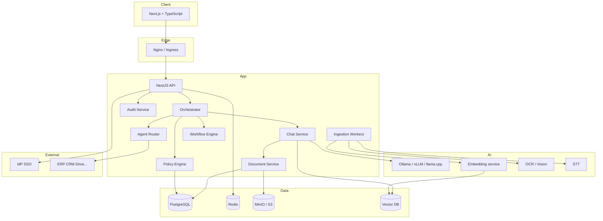
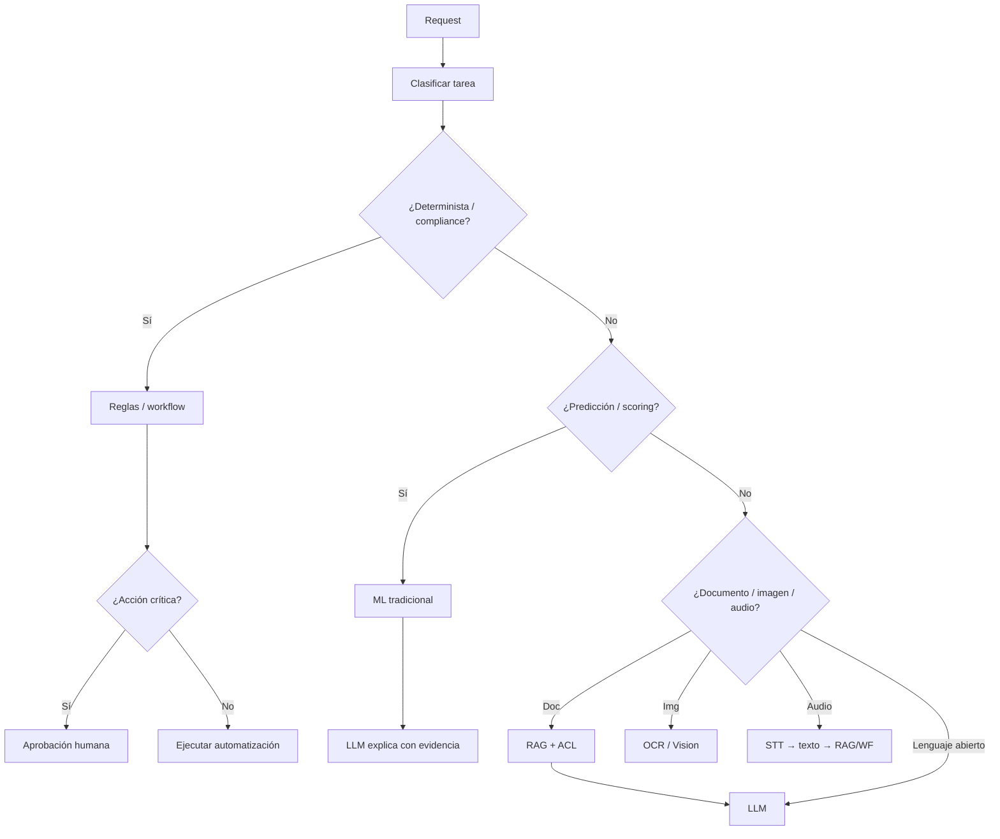
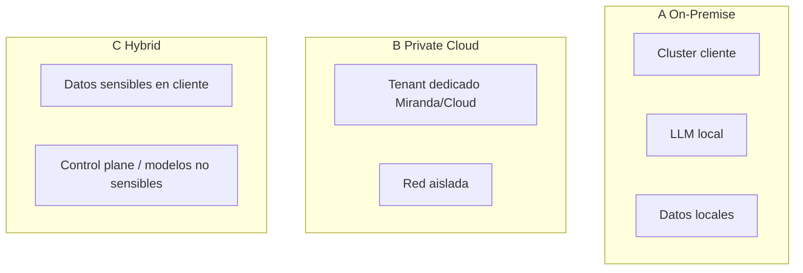

# Arquitectura técnica — Miranda

Estado: borrador modular (no cerrado). Decisiones stack: ver MEMORY `D-006`, `D-013`–`D-018`, `D-022`.

---

## 1. Vista lógica



---

## 2. Stack recomendado (JS/TS)

Fuente de detalle del stack. Decisiones fijadas: `D-006`, `D-013`–`D-018`, `D-022`.

### MVP mínimo

```text
Next.js + NestJS + Prisma + PostgreSQL/pgvector
+ Redis + BullMQ + MinIO + Keycloak + Ollama + Docker Compose
```

### Tabla por área

| Área | Tecnología | Descripción básica | Alternativa | Por qué esa 2.ª opción |
|------|------------|--------------------|-------------|------------------------|
| **Lenguaje** | TypeScript | Tipado estático en frontend, API y workers; menos errores en contratos. | JavaScript | Solo si un módulo legacy no admite TS; no recomendado para núcleo. |
| **Frontend** | Next.js | App web chat + admin; SSR/API routes si hace falta BFF. | Remix | Similar en TS/React; útil si se prefiere routing loader/action más simple. |
| **Backend** | NestJS | API modular (auth, org, chat, audit, tools); DI y estructura enterprise. | Fastify | Más liviano y rápido; buena si NestJS se siente pesado para un PoC chico. |
| **API style** | REST + OpenAPI | Contrato claro para web, móvil y conectores ERP/CRM. | tRPC | Tipado extremo end-to-end si web y API viven solo en el monorepo. |
| **DB** | PostgreSQL | Datos de negocio, permisos, auditoría, tenancy (`tenant_id`). | — | Estándar MVP; no hay 2.ª opción preferida. |
| **ORM** | Prisma | Modelos, migraciones y queries tipadas en TS. | Drizzle | Más SQL-like y liviano; mejor control fino / performance en queries complejas. |
| **Vectors / RAG** | pgvector | Embeddings en la misma Postgres; ACL por `document_id` + `tenant_id` (D-013). | Qdrant | Cuando el volumen de vectores crece o se quiere DB vectorial dedicada. |
| **Cache / queues** | Redis + BullMQ | Cache de sesión/permisos + jobs de ingesta, embed y procesamiento. | Redis solo / Kafka | Redis solo al inicio; Kafka si hay eventos de alto volumen multi-servicio. |
| **Files** | MinIO (S3) | Object storage on-prem compatible S3 para documentos/adjuntos. | Filesystem local | Demo ultra-simple sin MinIO; no apto multi-nodo ni enterprise. |
| **Auth / SSO** | Keycloak (OIDC) | IdP local para demo SSO; luego federar Entra/Google/Okta (D-014). | Auth.js + IdP directo | Menos ops si el cliente ya trae Entra/Google y no quieres Keycloak en medio. |
| **LLM local** | Ollama (`llama3.1:8b`) | Inferencia local/on-prem para privacidad y costo bajo (D-018). | vLLM | Mejor throughput en GPU/servidor cuando hay muchos usuarios concurrentes. |
| **LLM cloud** | OpenAI / Anthropic SDK | Opción híbrida (VPN/admin); mismo contrato de tools/orquestación. | Gemini / Azure OpenAI | Preferencia del cliente o datos que deben quedarse en su nube. |
| **Embeddings** | `nomic-embed-text` (Ollama) | Vectores locales sin enviar texto a IA pública. | OpenAI embeddings | Mejor calidad/ecosistema si air-gap no es requisito. |
| **Orchestrator** | LangGraph.js / propio | Intención → RAG / tools / procesos; control del flujo. | Vercel AI SDK | Más rápido para chat streaming UI; menos control de workflows complejos. |
| **Workers** | Node + BullMQ | Ingesta: parse → chunk → embed; tareas pesadas fuera del request. | NestJS microservices | Si ya hay varios servicios Nest y se quiere el mismo patrón. |
| **Mobile** | React Native / Expo | App de aprobación / chat con el mismo backend TS. | PWA primero | Menos costo al inicio; suficiente para autorizar desde el móvil. |
| **Validación** | Zod | Schemas compartidos (API, tools, formularios). | — | Estándar con TS; sin alternativa fuerte en el stack. |
| **Logs / audit** | Pino + tabla audit | Logs estructurados + bitácora de quién/qué/cuándo. | OpenTelemetry | Trazas distribuidas cuando hay muchos servicios en prod. |
| **Deploy** | Docker Compose | Empaquetado demo/on-prem simple (web, api, db, redis, minio, keycloak). | Kubernetes | Escalado, HA y multi-nodo en clientes enterprise. |
| **Reverse proxy** | Nginx / Traefik | TLS, rutas, compresión, edge frente a la API. | Traefik (si Nginx es 1.ª) | Traefik brilla con Docker labels y certificados automáticos. |
| **Conectores ERP/CRM** | Adapters HTTP propios | Traducen procesos canónicos → SAP/Salesforce/Odoo/API custom. | n8n (opcional) | Acelera integraciones no críticas; el núcleo de permisos sigue en Miranda. |

### Enterprise scale (después del MVP)

- Kubernetes
- Kafka (eventos de alto volumen)
- Vector DB dedicada (Qdrant/Milvus)
- vLLM + model routing
- Observabilidad (OpenTelemetry + Prometheus/Grafana)
- Secrets: Vault / cloud KMS

**No son obligatorias** todas las tecnologías; se eligen por escenario. El MVP usa el bloque mínimo de arriba.

---

## 3. Principio de selección de inteligencia



---

## 4. Despliegue A / B / C



| | On-Prem | Private Cloud | Hybrid |
|--|---------|---------------|--------|
| Seguridad percibida | Muy alta | Alta | Alta |
| Time-to-value | Más lento | Medio | Medio |
| Ops | Cliente + Miranda | Miranda managed | Compartido |
| Data residency | Total | Según región | Configurable |
| Mejor para | Regulados / air-gap | Mid-market enterprise | Transición gradual |

---

## 5. Límites del LLM en la arquitectura

El LLM puede:

- Generar lenguaje, resúmenes, borradores
- Explicar resultados de otras piezas
- Extraer campos con validación posterior

El LLM **no** puede:

- Decidir autorización
- Ejecutar acciones críticas sin workflow
- Inventar KPIs/estadísticas
- Saltar tenant o ACL

Implementación: Policy Engine + tool allowlists + retrieval filtrado + post-checks.

---

## 6. Paquetes MVP (contenedores lógicos)

1. `miranda-web`
2. `miranda-api`
3. `miranda-worker-ingest`
4. `miranda-llm` (o externo al compose)
5. `postgres`, `redis`, `minio`, `vector`

Detalle de compose/k8s: módulo M13.
