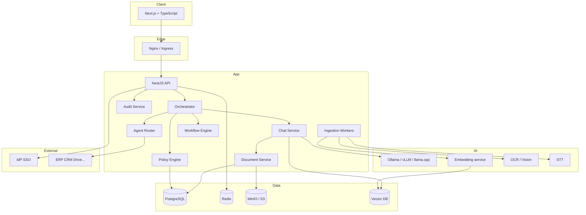
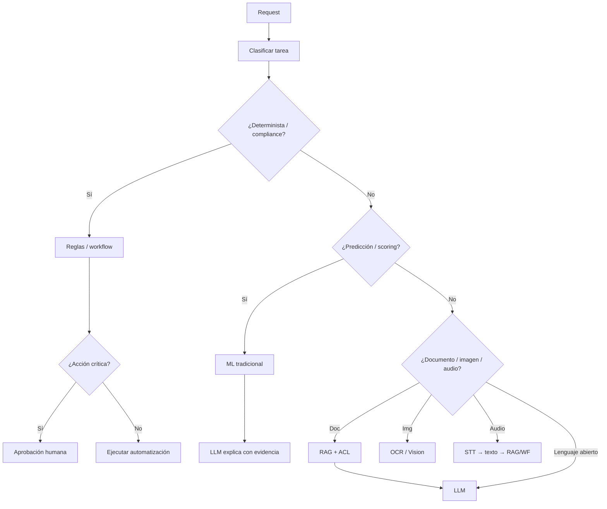
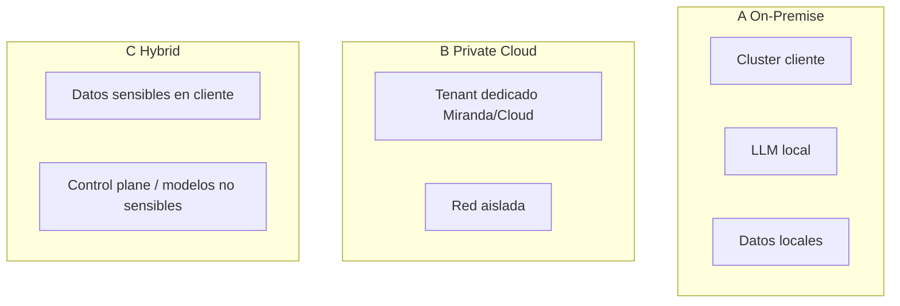

# Arquitectura técnica — Miranda

Estado: borrador modular (no cerrado). Decisiones stack: ver MEMORY `D-006`, pendientes `P-001..P-004`.

---

## 1. Vista lógica

---

## 2. Stack recomendado por escenario

### MVP / PoC on-prem

| Capa | Opción preferida | Alternativa |
|------|------------------|-------------|
| Frontend | Next.js + TS | — |
| Backend | NestJS | Express solo si se necesita ultra-mínimo |
| DB | PostgreSQL | — |
| Cache / cola ligera | Redis | — |
| Objects | MinIO | S3 |
| Vectors | **PostgreSQL + pgvector** (D-013); Qdrant/Milvus si escala | Weaviate/Milvus |
| LLM | **Ollama `llama3.1:8b`** (D-018) / vLLM (prod) | llama.cpp, MLX (Apple) |
| Auth | **Keycloak local** (D-014); Entra/Google después | Auth0/Okta |
| Ingress | Nginx | Traefik |

### Enterprise scale

- Kubernetes
- Kafka (eventos de alto volumen)
- Vector DB dedicada (Qdrant/Milvus)
- vLLM + model routing
- Observabilidad (OpenTelemetry + Prometheus/Grafana)
- Secrets: Vault / cloud KMS

**No son obligatorias** todas las tecnologías del prompt maestro; se eligen por escenario.

---

## 3. Principio de selección de inteligencia

---

## 4. Despliegue A / B / C

| | On-Prem | Private Cloud | Hybrid |
|--|---------|---------------|--------|
| Seguridad percibida | Muy alta | Alta | Alta |
| Time-to-value | Más lento | Medio | Medio |
| Ops | Cliente + Miranda | Miranda managed | Compartido |
| Data residency | Total | Según región | Configurable |
| Mejor para | Regulados / air-gap | Mid-market enterprise | Transición gradual |

---

## 5. Límites del LLM en la arquitectura

El LLM puede:

- Generar lenguaje, resúmenes, borradores
- Explicar resultados de otras piezas
- Extraer campos con validación posterior

El LLM **no** puede:

- Decidir autorización
- Ejecutar acciones críticas sin workflow
- Inventar KPIs/estadísticas
- Saltar tenant o ACL

Implementación: Policy Engine + tool allowlists + retrieval filtrado + post-checks.

---

## 6. Paquetes MVP (contenedores lógicos)

1. `miranda-web`
2. `miranda-api`
3. `miranda-worker-ingest`
4. `miranda-llm` (o externo al compose)
5. `postgres`, `redis`, `minio`, `vector`

Detalle de compose/k8s: módulo M13.
