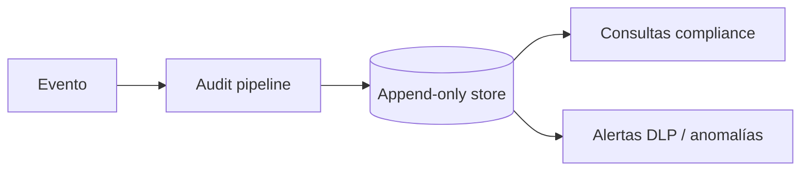

# Auditoría, seguridad y compliance

IDs: `F-AUD-*`, `F-SEC-009..012`

---

## 1. Qué se registra

Para cada interacción relevante:

- Usuario, fecha/hora, IP, dispositivo
- Acción
- Documento(s) consultados / descargados
- Prompt (con política de retención)
- Herramientas usadas
- Datos recuperados (ids/refs, no necesariamente payload completo)
- Resultado / cambios
- Aprobaciones

Preguntas que el sistema debe poder responder:

- ¿Quién consultó el salario de Juan?
- ¿Quién descargó este contrato?
- ¿Quién ejecutó la nómina?
- ¿Qué información usó la IA para esta recomendación?

---

## 2. Controles de seguridad

- Zero Trust
- Least Privilege
- Encryption at rest / in transit
- Secrets & key management
- Tenant / network isolation
- Audit logs
- DLP en export/share (Fase 3)

---

## 3. Privacidad y regulaciones

Considerar (sin afirmar cumplimiento automático):

- Protección de datos personales
- GDPR
- Australian Privacy Act
- Regulaciones sectoriales (salud, finanzas, etc.)
- Retención y derecho de eliminación
- Data residency

### Debe validarse con especialistas legales/compliance

| Tema | Por qué no lo cierra solo ingeniería |
|------|--------------------------------------|
| Bases legales de tratamiento | Depende del país/cliente |
| Retención de prompts/logs | Tensiona auditoría vs minimización |
| Transferencias internacionales | Hybrid/cloud |
| Sector-specific (PHI, PCI…) | Controles adicionales |
| Cláusulas contractuales con subprocesadores | Comercial/legal |

Miranda documenta controles técnicos; **la certificación/adecuación legal es del cliente + counsel**.
