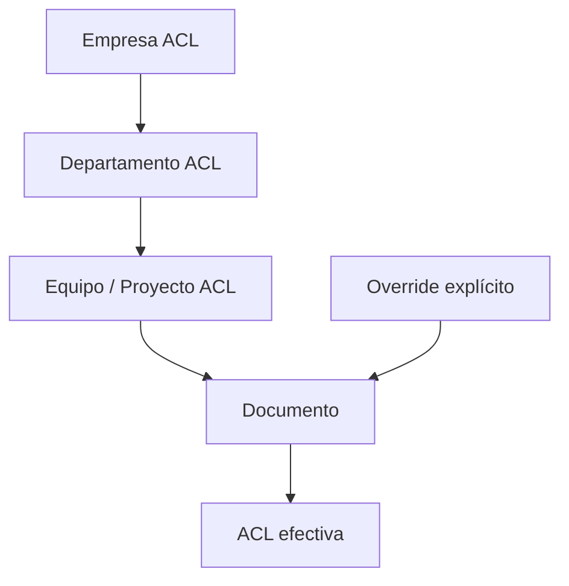
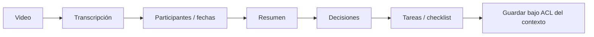
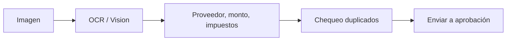

# Documentos y multimedia

IDs: `F-DOC-*`, `F-AI-003/004`

---

## 1. Tipos de contenido

PDF · DOCX · XLSX · CSV · PPTX · imágenes · audio · video · emails · contratos · planos · manuales · grabaciones · docs técnicos

---

## 2. Metadatos mínimos

```text
archivo: Contrato_Cliente_ABC.pdf
empresa, departamento, uploader, owner, fecha
tipo_documento, cliente, proyecto, país, sucursal
confidentiality, clasificación, etiquetas, estado
expiración, versión, permisos/ACL
```

### Clasificación

`PUBLIC` → `INTERNAL` → `CONFIDENTIAL` → `RESTRICTED` → `HIGHLY CONFIDENTIAL`

Los permisos se heredan de Empresa → Departamento → Equipo → Proyecto → Usuario, con **override** explícito.



---

## 3. Pipeline multimodal

### Video de reunión



### Imagen de factura



Todo el output hereda la ACL del contenedor (proyecto/departamento) salvo política más restrictiva detectada.
