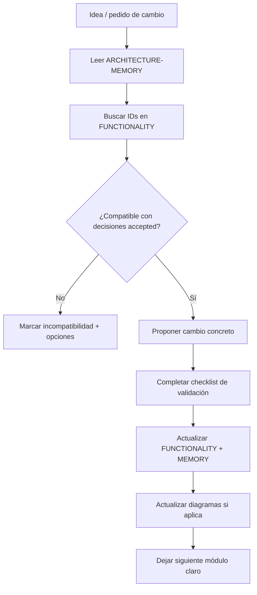

# Cómo iterar la idea sin perder contexto

Miranda es un proyecto **evolutivo**. Este documento define el protocolo para modificar la idea con la IA (o con el equipo) sin romper la coherencia.

---

## Flujo de cambio



---

## Comandos de trabajo con la IA

| Frase del usuario | Qué debe hacer la IA |
|-------------------|----------------------|
| `ejecuta Fase N` | Implementar la fase N del [BUILD-README](./BUILD-README.md) (DoD anterior debe estar done) |
| `continuar` | Siguiente fase build pending, o siguiente módulo diseño si se pide detalle |
| `validar` | Correr checklist de FUNCTIONALITY sobre el último cambio |
| `decidir X` | Registrar decisión en ARCHITECTURE-MEMORY |
| `posponer X` | Marcar ID como `deferred` con motivo |
| `rechazar X` | Marcar ID como `rejected` con motivo |
| `mostrar memoria` | Resumir decisiones / pendientes / riesgos |
| `impacto de X` | Analizar qué IDs y módulos toca X |

---

## Qué archivos tocar según el tipo de cambio

| Tipo de cambio | Archivos mínimos |
|----------------|------------------|
| Nueva funcionalidad | FUNCTIONALITY + MEMORY (+ módulo si aplica) |
| Cambio de arquitectura | ARCHITECTURE + MEMORY + diagramas README |
| Cambio de permisos/auth | AUTH-AND-PERMISSIONS + FUNCTIONALITY + MEMORY |
| Cambio de RAG/seguridad | RAG-AND-SECURITY + FUNCTIONALITY + MEMORY |
| Nuevo caso de negocio | BUSINESS-OPPORTUNITIES + FUNCTIONALITY (si entra a producto) |
| Cambio de roadmap/pricing | ROADMAP-AND-BUSINESS + MEMORY |
| Ejemplo / demo | EMPRESA-A |

---

## Plantilla de propuesta de cambio

```md
## Propuesta
Qué cambia y por qué.

## IDs afectados
- F-xxx-00N (estado actual → nuevo)

## Impacto en decisiones previas
- Compatible / Incompatible con D-00N

## Riesgos
- …

## Validación FUNCTIONALITY
(pegar checklist)

## ¿Requiere actualizar diagramas?
Sí / No
```

---

## Orden de lectura recomendado para la IA

1. `README.md`
2. `docs/FUNCTIONALITY.md`
3. `docs/ARCHITECTURE-MEMORY.md`
4. Módulo activo en `docs/MODULES.md`
5. Docs especializados del módulo
