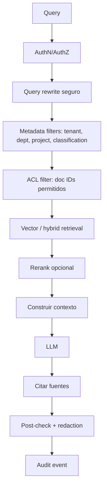

# RAG empresarial seguro

IDs: `F-RAG-*`, `F-SEC-*`

---

## 1. Problema que resolvemos

Un chat empresarial sin ACL es un **motor de fuga de información**.

Escenario prohibido:

```
Usuario A (sin RRHH)
→ busca "salarios"
→ el sistema recupera docs de nómina
→ el LLM resume salarios
```

Resultado correcto: **0 chunks** de nómina en el contexto + auditoría del intento.

---

## 2. Pipeline RAG con ACL



### Estrategias

| Estrategia | Uso |
|------------|-----|
| Metadata filtering | tenant, orgUnit, tags, classification |
| ACL filtering | allow-list de documentIds del usuario |
| Document-level permissions | default Fase 1 |
| Chunk-level permissions | docs mixtos (Fase 3, F-RAG-005) |
| Row-level security | tablas/ERP (Fase 3) |
| Namespace isolation | un namespace/colección por tenant mínimo |

---

## 3. Amenazas y controles

| Amenaza | Control |
|---------|---------|
| Data leakage | ACL pre-LLM + deny-by-default |
| Prompt injection | Instrucciones de sistema aisladas; tools limitadas |
| Indirect prompt injection | Sanitizar docs; no ejecutar instrucciones de documentos |
| Excessive agency | Allowlist de tools + HITL |
| Privilege escalation | AuthZ independiente del texto del usuario |
| Cross-tenant leakage | namespace + tenant_id obligatorio en queries |
| Retrieval no autorizado | hard filter; tests de regresión de seguridad |

---

## 4. Contrato de respuesta

Toda respuesta grounded debe incluir:

- Texto
- Fuentes (doc id, título, fragmento/permiso)
- Advertencias (“requiere validación humana” si aplica)
- Motivo de bloqueo parcial si se omitieron datos

Si no hay fuentes autorizadas: responder “no tengo acceso / no hay información autorizada”, nunca alucinar política interna.

---

## 5. Fuentes de conocimiento (conectores)

Fase 1: upload directo.  
Fase 2+: SharePoint, Google Drive, OneDrive, Confluence, Jira, GitHub, email, CRM, ERP, APIs.

Cada conector debe sincronizar **ACL de origen → ACL Miranda** o mapear a políticas equivalentes. Sin mapeo de permisos = conector no se activa en producción.
