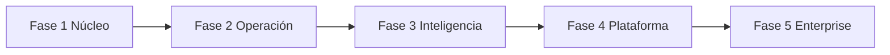
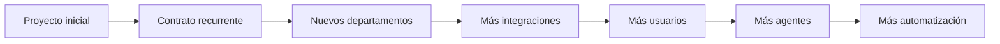

# Roadmap y modelo de negocio

IDs: `F-BIZ-*`, fases en FUNCTIONALITY

---

## 1. Roadmap por fases

### Fase 1 — Núcleo

Login SSO · Usuarios · Empresas · Departamentos · Roles · Permisos · Documentos · RAG ACL · Chat · Auditoría

**Outcome:** PoC vendible “preguntar a mis documentos sin filtrar datos”.

### Fase 2 — Operación

Agentes · Workflows · Aprobaciones · Integraciones IdP/Drive · Multimedia básico · Casos HR/AP

### Fase 3 — Inteligencia

Automatización avanzada · Predicción · ML · Recomendaciones con evidencia

### Fase 4 — Plataforma

Marketplace agentes · Marketplace conectores · Config no-code

### Fase 5 — Enterprise completo

Industry packs · escala multi-país · managed offerings maduros

---

## 2. Modelo de monetización

| Modelo | Cuándo |
|--------|--------|
| Implementación inicial (proyecto) | Entrada land |
| Licencia anual / suscripción | Core platform |
| Por usuario / departamento | Expansión |
| Por documentos / consumo tokens | Uso intensivo |
| Consultoría / integración | Conectores complejos |
| Soporte & mantenimiento | Recurrente |
| Managed AI | Clientes sin equipo ML/Ops |
| Enterprise license | Grandes cuentas |

### Land and expand

Empaquetado inicial sugerido:

1. **Miranda Core** (Fase 1)  
2. **Pack Vertical** (HR o Legal o AP)  
3. **Managed Private AI** (opcional)

Precios numéricos: **pendientes** (no inventar). Definir en M14 con research citado.

---

## 3. Go-to-market inicial (propuesta)

- Buyer: CIO + CHRO/General Counsel (según vertical)  
- Trigger: riesgo de datos en IA pública + caos documental  
- Wedge: RAG seguro + auditoría  
- Demo: Empresa A, 3 consultas con bloqueos  
- Éxito PoC: tiempo de búsqueda ↓ y 0 accesos indebidos en pruebas

---

## 4. Qué NO hacer al inicio

- Construir marketplace  
- Fine-tuning masivo  
- 100 integraciones  
- Agentes con EXECUTE amplio  
- Afirmar certificaciones legales sin evidence
